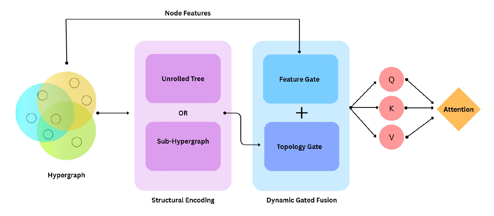

# Gated Fusion of Structure and Features for Hypergraph Attention

[](https://opensource.org/licenses/MIT)

## Introduction

Many real-world systems involve complex higher-order interactions that are most naturally modeled using hypergraphs. Existing approaches either restrict information flow to local neighborhoods through message passing or apply global transformer attention while relying on the Hypergraph Laplacian or adjacency matrix to structure representations, which lacks the expressivity needed to capture true polyadic interactions.

To address this limitation, we propose **HyperGraph Structure Gated Fusion-Transformer (HSGF-T)**, a structure-aware transformer for hypergraph node classification built on a novel **Hypergraph Structure-Aware Self-Attention** mechanism. This mechanism learns to combine a node’s features with its structural context, dynamically balancing what the node represents and how it is connected, without relying on predefined positional encodings.

Our method is agnostic to the choice of structural encoder, which we demonstrate through two instantiations: an expressive sub-hypergraph extractor and a scalable non-linear aggregator.

We theoretically show that embedding structural information throughout the entire attention mechanism, rather than restricting it only to the attention weights, prevents representational collapse and yields a strictly more expressive model. Empirically, we validate these guarantees by achieving state-of-the-art performance on diverse hypergraph benchmarks.



---

## Getting Started

### Dependencies

The following Python libraries are required to run the code:

```bash
Required libraries:
- PyTorch 1.8.0+
- PyTorch Geometric
- PyTorch Sparse libraries (torch-scatter, torch-sparse, torch-cluster)
- NumPy
- SciPy
- Matplotlib
- Seaborn
- Pandas
- ConfigArgParse
```

---

## Data Preparation

Download the preprocessed datasets from [Google Drive](https://drive.google.com/drive/folders/1vv-KmOUNuGqotZLtvEaX_Mck1xb--sqE?usp=drive_link).

Place the downloaded `data` directory under the root folder of this repository. The directory structure should look as follows:

```text
HSGF-T/
  <source code files>
  ...
  data/
    citeseer/
    coauthor_cora/
    cora/
    ...
```

---

## Training

To train HSGF-T, use the following command:

```bash
python train.py \
  --dname cora \
  --data_dir ./data/cora/ \
  --runs 10 \
  --n_layers 1 \
  --hidden_dim 128 \
  --dropout 0.2 \
  --lr 0.0008 \
  --wd 0 \
  --method HSAT \
  --mp_steps 2 \
  --w1 0 \
  --w2 0 \
  --w3 0 \
  --w4 0 \
  --w5 0 \
  --clf_layer 1
```

### Argument Description

- `--mp_steps` specifies the number of message-passing iterations in the main HSAT encoder. Larger values allow information aggregation from farther neighborhoods but may increase computation and oversmoothing.

- `--w1`, `--w2`, `--w3`, `--w4`, and `--w5` define the number of hidden layers in different internal MLP modules used inside HSAT. Setting a value of `0` corresponds to using an identity transformation.

- `--clf_layer` specifies the number of layers in the final classifier MLP used for node prediction.

- `--use_avg_gate` enables average-based gating instead of the default learned gating mechanism.

- `--pre_transform` applies a preprocessing feature transformation before the main message-passing network.

- `--use_rwpe` enables Random Walk Positional Encodings (RWPE) as additional node features.

- `--use_lappe` enables Laplacian Positional Encodings (LapPE) as additional node features.

- `--mp_steps_subhg` specifies the number of message-passing steps used inside the sub-hypergraph extractor module.

- `--subhg_hop` defines the hop distance used for constructing local sub-hypergraphs around each node.

- `--dname` specifies the dataset name.

- `--runs` specifies the number of repeated runs with different random seeds/splits for reporting averaged performance.

- `--method` selects the model architecture to train (e.g., `HSAT`).

---

## Reproducing Results

Please use the following commands to reproduce our reported results.

<details>
<summary><strong>Cora</strong></summary>

```bash
python train.py \
  --dname cora \
  --data_dir ./data/cora/ \
  --runs 10 \
  --n_layers 1 \
  --hidden_dim 256 \
  --dropout 0.7 \
  --lr 0.0008 \
  --wd 0 \
  --method HSAT \
  --mp_steps 2 \
  --w1 0 \
  --w2 0 \
  --w3 0 \
  --w4 0 \
  --w5 0 \
  --clf_layer 1
```

</details>

<details>
<summary><strong>Citeseer</strong></summary>

```bash
python train.py \
  --dname citeseer \
  --data_dir ./data/citeseer/ \
  --runs 10 \
  --n_layers 1 \
  --hidden_dim 256 \
  --dropout 0.7 \
  --lr 0.0008 \
  --wd 0 \
  --method HSAT \
  --mp_steps 2 \
  --w1 0 \
  --w2 0 \
  --w3 0 \
  --w4 0 \
  --w5 0 \
  --clf_layer 1
```

</details>

<details>
<summary><strong>NTU2012</strong></summary>

```bash
python train.py \
  --dname NTU2012 \
  --data_dir ./data/NTU2012/ \
  --runs 10 \
  --n_layers 1 \
  --hidden_dim 128 \
  --dropout 0.2 \
  --lr 0.0008 \
  --wd 0 \
  --method HSAT \
  --mp_steps 2 \
  --w1 1 \
  --w2 0 \
  --w3 1 \
  --w4 0 \
  --w5 1 \
  --clf_layer 2
```

</details>

<details>
<summary><strong>Cora-CA</strong></summary>

```bash
python train.py \
  --dname coauthor_cora \
  --data_dir ./data/coauthor_cora/ \
  --runs 10 \
  --n_layers 1 \
  --hidden_dim 256 \
  --dropout 0.7 \
  --lr 0.0008 \
  --wd 0 \
  --method HSAT \
  --mp_steps 2 \
  --w1 0 \
  --w2 0 \
  --w3 0 \
  --w4 0 \
  --w5 0 \
  --clf_layer 2
```

</details>

<details>
<summary><strong>DBLP-CA</strong></summary>

```bash
python train.py \
  --dname coauthor_dblp \
  --data_dir ./data/coauthor_dblp/ \
  --runs 10 \
  --n_layers 1 \
  --hidden_dim 128 \
  --dropout 0.5 \
  --lr 0.0008 \
  --wd 0 \
  --method HSAT \
  --mp_steps 2 \
  --w1 1 \
  --w2 0 \
  --w3 1 \
  --w4 0 \
  --w5 1 \
  --clf_layer 2
```

</details>

<details>
<summary><strong>Congress</strong></summary>

```bash
python train.py \
  --dname congress-bills \
  --data_dir ./data/congress-bills/ \
  --runs 10 \
  --n_layers 1 \
  --hidden_dim 128 \
  --dropout 0.3 \
  --lr 0.0008 \
  --wd 0 \
  --method HSAT \
  --mp_steps 2 \
  --w1 1 \
  --w2 0 \
  --w3 1 \
  --w4 0 \
  --w5 1 \
  --clf_layer 2
```

</details>

<details>
<summary><strong>Mushroom</strong></summary>

```bash
python train.py \
  --dname Mushroom \
  --data_dir ./data/Mushroom/ \
  --runs 10 \
  --n_layers 1 \
  --hidden_dim 128 \
  --dropout 0.1 \
  --lr 0.0008 \
  --wd 0 \
  --method HSAT \
  --mp_steps 2 \
  --w1 0 \
  --w2 0 \
  --w3 0 \
  --w4 0 \
  --w5 0 \
  --clf_layer 1
```

</details>

<details>
<summary><strong>Walmart</strong></summary>

```bash
python train.py \
  --dname walmart-trips \
  --data_dir ./data/walmart-trips/ \
  --runs 10 \
  --n_layers 1 \
  --hidden_dim 128 \
  --dropout 0.2 \
  --lr 0.0008 \
  --wd 0 \
  --method HSAT \
  --mp_steps 7 \
  --w1 2 \
  --w2 0 \
  --w3 0 \
  --w4 0 \
  --w5 2 \
  --clf_layer 2
```

</details>

<details>
<summary><strong>ModelNet40</strong></summary>

```bash
python train.py \
  --dname ModelNet40 \
  --data_dir ./data/ModelNet40/ \
  --runs 10 \
  --n_layers 1 \
  --hidden_dim 256 \
  --dropout 0.1 \
  --lr 0.0008 \
  --wd 0 \
  --method HSAT \
  --mp_steps 2 \
  --w1 0 \
  --w2 0 \
  --w3 0 \
  --w4 0 \
  --w5 0 \
  --clf_layer 1
```

</details>

---

## Citation

This repository is built upon the ED-GNN official repository:

- https://github.com/Graph-COM/ED-HNN